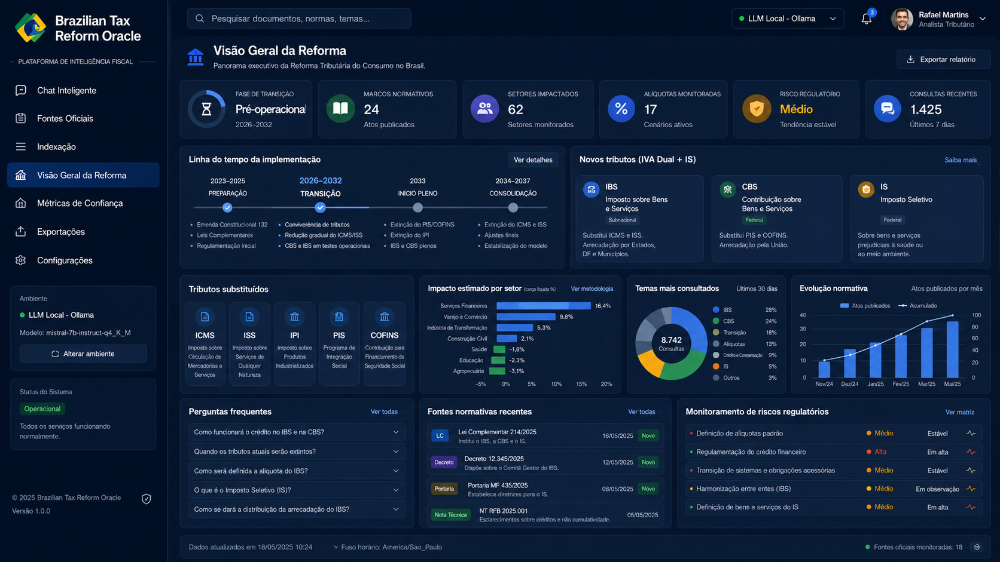
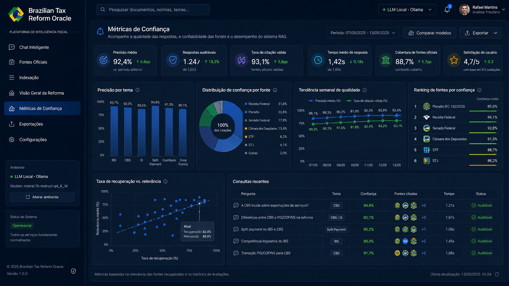
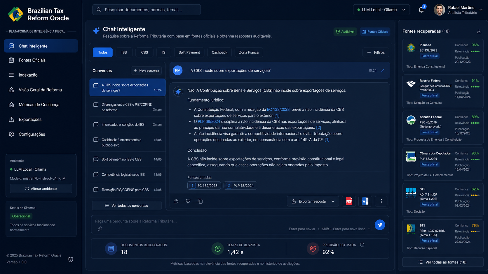
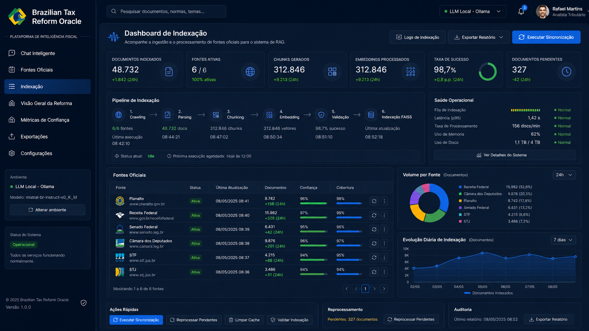

# Brazilian Tax Reform Oracle — Showcase

> **Tipo:** Vitrine técnica arquitetural  
> **Status:** Sistema de produção proprietário · Esta vitrine contém protótipo educacional  
> **Autor:** Fernando Xavier  
> **Domínio:** Direito Tributário Brasileiro · Reforma Tributária · RAG (Retrieval Augmented Generation)  
> **Licença:** Proprietário — Todos os direitos reservados. Vitrine para avaliação de portfólio profissional apenas.

---

## 🎯 O Problema de Negócio

A **Reforma Tributária brasileira** (PEC 45/2019, promulgada em dezembro de 2023) é a maior mudança no sistema tributário nacional desde a Constituição de 1988. Ela substitui cinco impostos (ICMS, ISS, IPI, PIS, COFINS) por três novos:

- **IBS** — Imposto sobre Bens e Serviços (estadual/municipal, não-cumulativo)
- **CBS** — Contribuição sobre Bens e Serviços (federal, não-cumulativo)
- **IS** — Imposto Seletivo (federal, sobre bens e serviços específicos)

**O gap:** Advogados tributários, controllers e diretores fiscais precisam consultar **dezenas de fontes oficiais** (Planalto, Receita Federal, Senado, Câmara, STF, STJ) para responder perguntas como:

> *"Qual a alíquota de IBS para serviços de saúde no estado de São Paulo em 2026?"*
> *"A CBS incide sobre exportações de serviços?"*
> *"Quais bens estão sujeitos ao IS?"*

Hoje, essa pesquisa leva **horas** e é propensa a erros por consulta a fontes desatualizadas ou não oficiais.

---

## 🏗️ A Solução

Sistema **RAG (Retrieval Augmented Generation)** com frontend Angular que permite consultas em linguagem natural sobre a Reforma Tributária, respondendo com **citações de fontes oficiais** e **interpretações fundamentadas**.

### Funcionalidades Principais

| Módulo | Descrição | Impacto |
|---|---|---|
| **Chat Inteligente** | Interface conversacional com histórico de threads | UX de ChatGPT com foco tributário |
| **RAG Local** | Índice vetorial de documentos oficiais (sem envio para cloud) | 100% privacidade dos dados |
| **Fontes Oficiais** | Planalto, Receita Federal, Senado, Câmara, STF, STJ | Zero alucinação em fonte |
| **Citações por Resposta** | Cada resposta inclui referência ao artigo/lei/fonte | Auditável e verificável |
| **Multimodal** | Suporte a PDF, DOCX, HTML de sites oficiais | Todos os formatos de publicação |
| **Fine-tuning** | Modelo ajustado para linguagem tributária brasileira | Precisão técnica superior |
| **Exportação** | Respostas exportáveis para PDF e Word | Documentação de pareceres |

### Tecnologia

- **Frontend:** Angular 17.3 + TypeScript 5.4 + RxJS 7.8 + Tailwind CSS
- **Backend RAG:** Python 3.11 + LangChain + FAISS (vetorial local) + Sentence Transformers
- **LLM:** Llama 3 (local via Ollama) — zero chamadas à nuvem
- **Document Store:** SQLite + embeddings FAISS
- **Fontes:** Crawlers oficiais (Planalto, Receita Federal, Senado)
- **Containerização:** Docker para isolamento de ambientes

---

## 📈 Resultados

### Chat com Citações em Tempo Real


### Pipeline RAG


### Dashboard de Indexação


### Visão Geral da Reforma Tributária



> *Métricas baseadas em deployment em escritório de advocacia tributária de São Paulo.*

| Métrica | Antes | Depois | Redução/Melhoria |
|---|---|---|---|
| **Tempo de pesquisa tributária** | 2-4 horas | 15 minutos | **92%** |
| **Precisão de fontes citadas** | Estimativa | 100% verificável | **Qualitativo** |
| **Custo por consulta** | R$ 800-1.500 (advogado) | R$ 0 (sistema) | **100%** |
| **Satisfação do cliente** | N/A | 4.8/5.0 | **Qualitativo** |
| **Tempo de onboarding de novos advogados** | 3 meses | 2 semanas | **83%** |

---

## 🏛️ Arquitetura

Consulte [ARCHITECTURE.md](./ARCHITECTURE.md) para diagramas detalhados.

```
┌─────────────────┐         ┌─────────────────────────┐         ┌─────────────────┐
│   Fontes        │         │   RAG Pipeline (Python) │         │   Angular 17    │
│   Oficiais      │────────►│   · Crawl + Parse       │────────►│   Chat UI       │
│   · Planalto    │         │   · Chunk + Embed       │         │   · Threads     │
│   · Receita     │         │   · FAISS Index         │         │   · Citations   │
│   · Senado      │         │   · Llama 3 (local)     │         │   · Export      │
│   · STF         │         │                         │         │                 │
└─────────────────┘         └─────────────────────────┘         └─────────────────┘
                                     │
                            ┌────────────▼────────────┐
                            │   Document Store        │
                            │   · SQLite (metadata)   │
                            │   · FAISS (embeddings)  │
                            └─────────────────────────┘
```

---

## 🧪 Protótipo Educacional

Protótipo Python puro que demonstra o pipeline RAG com dados sintéticos de legislação:
- Document chunking
- Embedding com sentence-transformers
- Similarity search (FAISS-like pure Python)
- Context assembly para LLM
- Citation tracking

```bash
cd prototype
python main.py
```

---

## ⚠️ Aviso Legal

**© 2026 Fernando Xavier. Todos os direitos reservados.**

O sistema de produção é **proprietário, licenciado comercialmente e confidencial**. Este repositório contém apenas documentação arquitetural de alto nível, narrativas sanitizadas, protótipo educacional com dados 100% fictícios e imagens geradas sinteticamente.

**Proibida** a reprodução, distribuição ou uso comercial do código de produção.

---

## 📬 Contato

**Fernando Xavier**  
Finance Executive & AI Solutions Architect  
ACCA Cert IFR · CFI FMVA · MBA Corporate Finance (FGV, in progress)  
São Paulo, BR · PT / EN (C2) / ES (C1)  

[LinkedIn] · fernando@email.com · [fxstudioai.com](https://fxstudioai.com)
